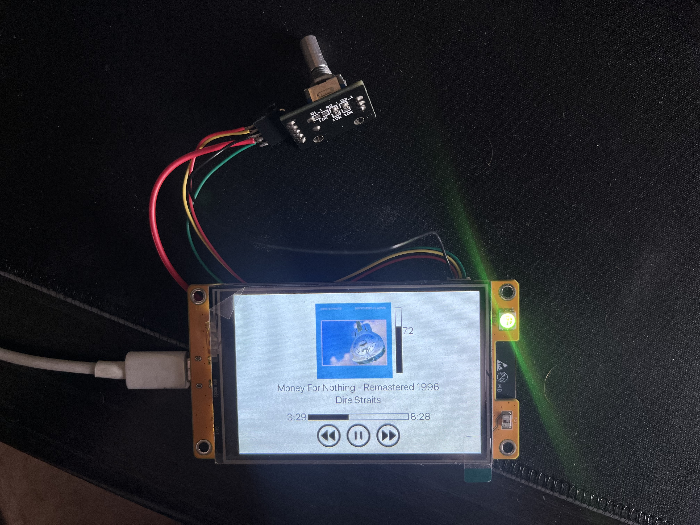

# SpotIno

A DIY project to make a functional Spotify controller using an ESP32 with a TFT LCD Module ST7796 3.5' (easy to find on markets like Aliexpress).

>[!warning]
>Compatibility is only guaranteed with this kind of display

This project also includes the possibility of searching between all your playlists and play a specific song

## Requirements
- Libraries
    - [TJpg_Decoder](https://github.com/Bodmer/TJpg_Decoder)
    - [TFT_eSPI](https://github.com/Bodmer/TFT_eSPI)
    - [SpotifyArduino](https://github.com/thegeek-sys/spotify-api-arduino)

## Usage
1. First of all you need to get your Refresh Token by following [this giude](https://github.com/witnessmenow/spotify-api-arduino/tree/main?tab=readme-ov-file#setup-instructions)

2. Once you have all the keys compile `secrets_sample.h` (needs to be renamed `secrets.h`) in this way:
    - `CLIENT_ID`: put the client id of the app from the guide above
    - `CLIENT_SECRET`: same as before
    - `SPOTIFY_REFRESH_TOKEN`: you have to paste the refres token you generated from `getRefreshToken` example from the guide above
    - `SPOTIFY_MARKET`: market of your Spotify (eg. EN, IT, ...)
    - `SSID`: SSID of your wireless network
    - `PASSWORK`: password of your wireless network

3. After you have finished compiling your Spotify informations you have to put the right pins for your display according to your configuration inside [`User_Setup.h`](https://github.com/Bodmer/TFT_eSPI/blob/master/User_Setup.h) (my [configuration](https://github.com/thegeek-sys/SpotIno/blob/main/User_Setup.h))

4. To calibrate touch make sure to [calibrate](https://github.com/Bodmer/TFT_eSPI/blob/master/examples/Generic/Touch_calibrate/Touch_calibrate.ino) your touch screen and edit `spot.ino` at line 34 `calData[5]`

5. Edit rotary encoder pins inside `spot.ino` (line 80) according to your configuration

Once you are done you can compile `spot.ino` and upload it to your ESP32!!

## Options
- Set static IP address: edit line 33 in `spot.ino`
- Light or dark theme: edit line 30 in `spot.ino` (you can choose between `LIGHT_THEME` and `DARK_THEME`)
